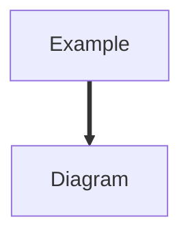

<!--
# Notes

PRD : Product Requirements Document

プロダクトに要求されていることが書かれた文書となります。PRD は、プロダクトに求められる要求を明確にし、チームメンバー間の認識を統一するために作成されます。

## 参考資料

- [初めて書く PRD（プロダクト要求仕様書）](https://note.com/miz_kushida/n/n7e35a2a2b370)
- [PRD の書き方と運用方法](https://book.st-hakky.com/purpose/ai-requirements-definition-prd/)
- [エンジニアチームの生産性の高め方〜開発効率を向上させて、人を育てる仕組みを作る](https://gihyo.jp/book/2024/978-4-297-14502-6)
- [Design Docs at Google](https://www.industrialempathy.com/posts/design-docs-at-google/)
- [メルカリ Shops での Design Docs 運用について](https://engineering.mercari.com/blog/entry/20220225-design-docs-by-mercari-shops/)

## 図表の記法

アーキテクチャ図、画面遷移図、ユーザーフロー、データモデル、状態遷移図などの図表は Mermaid 記法を使用してください。

-->

# 1. Intro & Goal

<!--
開発するプロダクトやこの PRD についての説明を書きます。特記するべきことがない場合はシンプルでかまいません。

このプロダクトや機能を開発するに至った背景などを記載します。多くの場合、問題や課題を記載することになります。
-->

# 2. Concept / Value Proposition

<!--
このプロダクトや機能に含めるものと含めないもののスコープを記載します。
-->

# 3. Product Vision

<!--
このプロダクトや機能が満たすべき原則を簡潔にまとめます。「何がどのようにできるものなのか」が完結に記述されていれば十分です。
-->

# 4. Who's it for? ｜誰のためにあるか

<!--
このプロダクトや機能が対象とするユーザーを記述します。特定の利用環境などによって対象ユーザーが制限される場合は、その利用環境なども併せて記載します。
-->

# 5. Why build it?｜なぜ創るか

<!--
提案される開発がなぜ必要なのかの理解を深めるために、このプロダクトや機能がどのような問題を解決するのかを記述します。
-->

# 6. What is it?｜どういうものか

<!--
対象ユーザーがこのプロダクトや機能をどのように使用するかを記述します。
ここを見れば何を作ればよいかが分かる内容を記載します。ここでは、シンプルに必要とされる機能の記述に徹します。
プロダクトや機能に対して技術的な部分での要求が何かある場合に記述します。求められるパフォーマンスやセキュリティ、プライバシーなどで特に守るべきことがあれば、それらも記載します。
-->

## 6–1. Glossary ｜用語

<!-- table -->

| Term | Definition |
| ---- | ---------- |
| TERM | DEFINITION |

## 6–2. User Types

## 6–3. UI/Screens/Functionalities ｜ UI/画面/機能

# 7. Brainstormed Ideas ｜その他アイデア

# 8. Competitors & Product Inspiration ｜競合

<!--
このプロダクトの対象マーケットに関する分析結果を記述します。
このプロダクトや機能の競合相手に関する分析結果を記述します。
-->

# 9. Seeding Users & Content ｜初期ユーザーと獲得戦略

<!--
このプロダクトや機能に関するマーケティング計画があれば記述します。
このプロダクトや機能の評価を行うための指標となる KPI をここに記載します。
-->

# 10. Mockups

<!--
UI のモックアップやワイヤーフレームを掲載します。画面遷移図やユーザーフローがある場合もここに含めます。
スケジュールやマイルストーンは別セクション（Tech Notes 等）で扱います。
-->

# 11. Tech Notes

<!--
技術的観点でのメモを記述します。以下の項目を含めることを推奨します:
- アーキテクチャの概要や構成図
- 技術スタック（言語、フレームワーク、インフラ）の選定理由
- 外部サービス連携やAPI設計のポイント
- パフォーマンス要件やスケーラビリティの考慮事項
- スケジュール・マイルストーン
-->

## 11–1. Infrastructure & Cloud Architecture ｜インフラ・クラウドアーキテクチャ

<!--
クラウドインフラの設計方針と構成を記述します。以下の観点を含めてください:
- クラウドプロバイダーとアカウント / サブスクリプション構成
- ネットワーク設計（仮想ネットワーク / サブネット / 接続方式）
- コンピュート戦略（VM / コンテナ / FaaS 等の選定理由）
- データストア選定（RDBMS / NoSQL / オブジェクトストレージ等）と設計方針
- IaC ツール（Terraform / CDK / Bicep / CloudFormation 等）の採用方針
- 移行戦略（6Rs: Rehost / Replatform / Refactor / Repurchase / Retire / Retain）
- Well-Architected Framework に基づく設計判断

Mermaid 記法でアーキテクチャ構成図を記載することを推奨します。
-->

## 11–2. Operational Requirements ｜運用要件

<!--
運用面の要件と設計方針を記述します。以下の観点を含めてください:
- 可用性要件（SLA / マルチ AZ / マルチリージョン）
- DR 戦略と RPO（目標復旧時点）/ RTO（目標復旧時間）
- オブザーバビリティ（ログ / メトリクス / トレース）の設計
- Auto Scaling / キャパシティプランニングの方針
- インシデント管理・オンコール体制
- バックアップ・リテンションポリシー
-->

## 11–3. Cost & FinOps ｜コスト管理

<!--
コスト管理と最適化の方針を記述します:
- 月額予算の上限と想定コスト内訳
- コスト最適化施策（予約インスタンス / コミットメント割引 / スポット / Right-sizing 等）
- コスト配分タグとプロジェクト別按分の設計
- FinOps プラクティスの導入方針
-->

# 12. References

<!--
参考資料やリンクを記載します。一次情報（公式ドキュメント、仕様書、RFC）を優先し、二次情報（記事、チュートリアル）は区別して記載します。

形式:
- [タイトル](URL) — 関連性の簡単な説明
-->